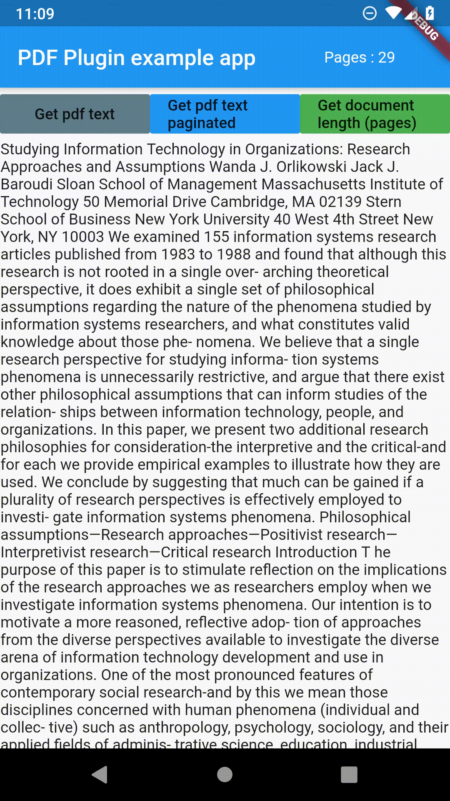

# read_pdf_text

This package parses text out of PDF documents and returns it as a string. 
On Android the plugin uses [PDFbox](https://github.com/TomRoush/PdfBox-Android) open source library modified by Tom Roush.
The iOS version is not implemented yet.


## Getting Started

The package only has three functions getPDFtext(path), getPDFtextPaginated(path) and getPDFlength(path).
Path is the file path to the PDF file you want to parse. I used [file_picker](https://pub.dev/packages/file_picker) package in the example to get the path of PDF file.

Check the example for more details.

## Example



## getPDFtext(String path) 
Returns all text from PDF file as a String.
```dart
    Future<String> getPDFtext(String path) async {
    String text = "";
    try {
      text = await ReadPdfText.getPDFtext(path);
    } on PlatformException {
      text = 'Failed to get PDF text.';
    }
    return text;
  }
```

## getPDFtextPaginated(path) 
Returns all text from PDF but in a List<String>, where each item is a page of the PDF file.
```dart
  Future<List<String>> getPDFtextPaginated(String path) async {
    List<String> textList = List<String>();
    try {
      textList = await ReadPdfText.getPDFtextPaginated(path);
    } on PlatformException {}
    return textList;
  }
```

## getPDFlength(path) 
Returns length of the document as integer.
```dart
  Future<int> getPDFlength(String path) async {
    int length = 0;
    try {
      length = await ReadPdfText.getPDFlength(path);
    } on PlatformException {}
    return length;
  }
```